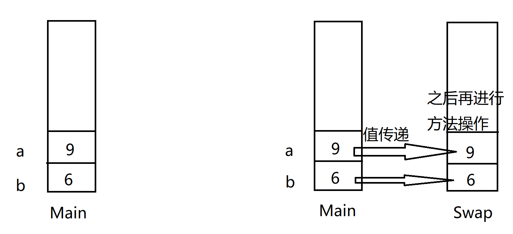
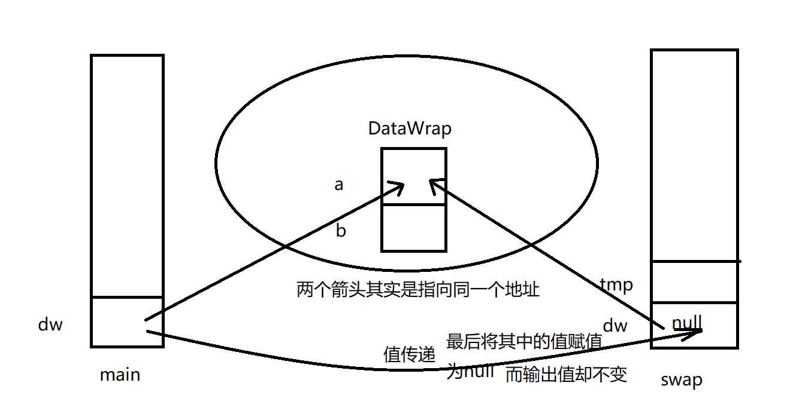

##	简答
1.	平台是由CPU和操作系统共同决定的，由于主流操作系统都可以支持主流的操作系统比如说Windows 和Linux等等，操作系统也可称为平台。计算机高级语言按照程序的执行方式可以分为;
	*	编译型语言比如说C/C++/Pascal等等，需要专门的编译器针对特定的平台将源代码直接翻译成为该平台硬件可执行的机器码(机器指令和操作数)，并且包装成为该平台所能识别的可执行性程序的格式，生成的可执行程序在特定的平台上运行，在某些平台不能运行，因为直接翻译成为的机器码不能执行。所以说是是依赖于平台的。
	*	解释型语言比如说Python等等，需要特定的解释器对源代码逐行翻译成为机器码立即执行，这个过程相当于包含了编译和解释， 因此在执行解释型语言时效率低，相当于在执行前都要一次编译。但是跨平台容易，只需要平台提供特定的解释器。
	*	而对于Java语言，编写的程序需要编译和翻译，在编译生成的.class文件就是编译结果，包含的不是机器码，而是字节码，需要Java解释器执行。不同平台的JVM(Java虚拟机:运行字节码的虚拟计算机)给.class不同的机器指令，翻译后的字节码可以在对应平台上面运行。
参考了[博客](https://www.cnblogs.com/alilcu/p/8068508.html)
2.	*	JDK是用于开发Java应用开发，提供了编译、运行和类库等的开发包。
	*	而JRE是java运行时环境，JDK包含了JRE。因而要开发Java程序需要JDK当然也可以运行，若只是运行程序只需要JRE。
	参考了书：疯狂java讲义
3.	*	最大的区别：值传递是将实际参数值的副本传入方法，而实际参数本身不会受到影响；
```
package 方法详解;

public class 参数传递 {

	public static void swap(int a ,int b)
	{
		//测试交换值
		int tmp = a ;
		a = b;
		b = tmp;
		System.out.println("方法中的值"+a+"\b"+b);
	}
	public static void main(String[] args)
	{
		//值传递：实际参数的复制品
		int a = 6;
		int b = 9;
		//调用方法：验证了复制品：程序改变的只是swap方法中的值
		swap(a,b);
		System.out.print("方法外部的值"+a+"\n"+b);
	}
}
//最终输出的结果是：
方法中的值9 6
方法外部的值6
9
//可以见到的是方法外部的值没有交换，而方法内的值交换了
```

```
package 方法详解;

class DataWrap
{
	int a ;
	int b ;
}

public class 参数传递中的易混淆 {
	//传入形参的方式是值传递
	public static void swap(DataWrap dw) 
	{
		//依旧是实现值交换
		int tmp = dw.a;
		dw.a = dw.b;
		dw.b = tmp;
		System.out.println("swap方法里："+dw.a+"\n"+dw.b);
		
		//证明swap()和main()中的dw是不同的值：
		//swap失去了DataWrap的引用：而在main方法中输出的仍然不变
		dw = null;
		
	}
	public static void main(String[] args)
	{
		DataWrap dw = new DataWrap();
		dw.a = 6;
		dw.b = 9;
		//实际引用的是复制了的一个新的,而这个新的也是直接指向DataWrap
		swap(dw);
		//参数传入方法改变了DataWrap中的值
		//因而重新调用的是已经改变了的值，从而形成“错觉”
		System.out.println("交换结束以后："+dw.a+"\n"+dw.b);
		//总而言之，只是指向了同一个对象
	}
}
```



参考了[博客](https://www.cnblogs.com/volcan1/p/7003440.html)、和前面一样的书
